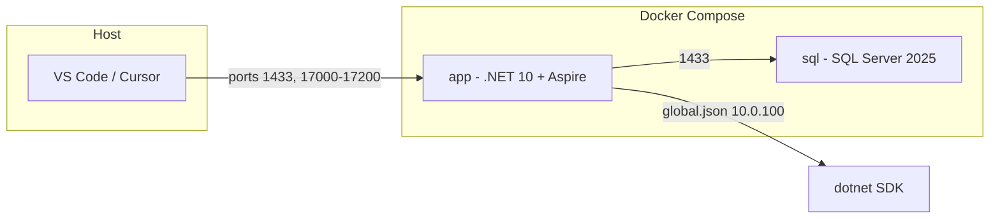

# .devcontainer configuration for MeshPoint

## Current state

- **[global.json](global.json)** pins SDK `10.0.100` with `rollForward: "latestFeature"` — no changes needed; the devcontainer will mount the repo, so all `dotnet` commands run in the workspace will use this.
- **Solution**: [kraftmesh.sln](kraftmesh.sln) with Aspire AppHost, ServiceDefaults, Api, Client, and Core.
- **No existing** `.devcontainer` folder.

## Target layout

```
.devcontainer/
  devcontainer.json      # Main config, references docker-compose
  docker-compose.yml    # Dev container + SQL Server 2025 sidecar
```

## 1. `.devcontainer/docker-compose.yml`

- **Service `app`** (main dev container):
  - Image: `mcr.microsoft.com/devcontainers/dotnet:10.0`
  - Build context: same directory (or no build; image only).
  - Volumes: mount workspace (e.g. `..`) and optional Docker socket if needed.
  - Depends on `sql` so SQL is up when the app starts.
  - Environment: pass `MSSQL_SA_PASSWORD` and connection info so the app can reach SQL (e.g. `ConnectionStrings__DefaultConnection` or `SqlServer__ConnectionString` pointing at host `sql`, port 1433).
- **Service `sql`** (sidecar):
  - Image: `mcr.microsoft.com/mssql/server:2025-latest` (SQL Server 2025 is available; use 2022 tag if you prefer).
  - Environment: `ACCEPT_EULA=Y`, `MSSQL_SA_PASSWORD` (strong password, e.g. `DevContainerSql1!` or from `.env`), optional `MSSQL_PID=Developer`.
  - Ports: expose `1433:1433` so the app container and host can connect.
  - Restart: `unless-stopped` or `no` for dev.

No need to install SQL tools in the app container unless you want them; the app only needs a connection string to `sql:1433`.

## 2. `.devcontainer/devcontainer.json`

- `**name**`: e.g. `"KraftMesh (.NET 10 + Aspire)"`.
- `**dockerComposeFile**`: `"docker-compose.yml"`.
- `**service**`: `"app"` (the .NET dev container).
- `**workspaceFolder**`: `"/workspaces/MeshPoint"` (or the default used by your Dev Containers setup; often `/workspaces/<repo-name>`).
- `**forwardPorts**`: Include `1433` for SQL and the Aspire range as a string: `"17000-17200"` (supported by the devcontainer spec for port ranges).
- `**portsAttributes**` (optional): e.g. label `17000` as “Aspire Dashboard” and `1433` as “SQL Server”; set `onAutoForward` as desired.
- `**postCreateCommand**`: run `dotnet workload install aspire` so the Aspire workload is available (uses SDK 10.x because of global.json).
- `**postStartCommand**` (optional): e.g. `dotnet workload list` to confirm Aspire is installed.
- `**customizations**` (optional): VS Code extensions (e.g. C#, SQL Server, Docker) and settings.
- `**remoteEnv**` (optional): if the app expects a connection string env var, set it to `Server=sql;Database=...;User Id=sa;Password=${localEnv:MSSQL_SA_PASSWORD}` or a fixed dev password.

No need to copy or modify `global.json`; it stays at the repo root and is respected automatically.

## 3. Port forwarding summary

| Port(s)       | Purpose                                                                        |
| ------------- | ------------------------------------------------------------------------------ |
| `1433`        | SQL Server (sidecar).                                                          |
| `17000-17200` | Aspire Dashboard and service discovery (single range entry in `forwardPorts`). |

## 4. SQL Server 2022 vs 2025

- **2025**: Use image `mcr.microsoft.com/mssql/server:2025-latest` (available on MCR).
- **2022**: Use `mcr.microsoft.com/mssql/server:2022-latest` if you prefer.

Plan uses **2025** unless you specify otherwise.

## 5. Security / env

- Put `MSSQL_SA_PASSWORD` in `.devcontainer/.env` (and add `.env` to `.gitignore` if you don’t want to commit it), or set it in `docker-compose.yml` for local dev only.
- Ensure the app’s connection string in the container points to host `sql` and the same password.

## 6. Diagram



## Implementation steps

1. Create `.devcontainer/docker-compose.yml` with `app` (devcontainer image) and `sql` (SQL 2025), shared env for password, and port 1433.
2. Create `.devcontainer/devcontainer.json` with `dockerComposeFile`, `service: app`, `forwardPorts: [1433, "17000-17200"]`, and `postCreateCommand: dotnet workload install aspire`.
3. Optionally add `.devcontainer/.env.example` with `MSSQL_SA_PASSWORD=...` and document in a short README or comment; add `.env` to `.gitignore` if used.

After this, opening the project in a Dev Container will use .NET 10 (per global.json), Aspire workload, SQL Server 2025 on port 1433, and forwarded ports 17000-17200 for the Aspire dashboard and services.
