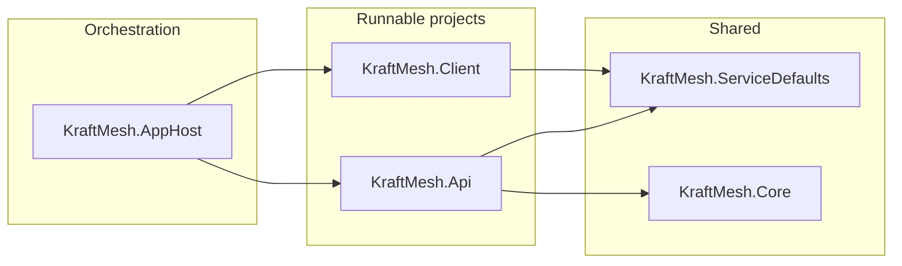

# KraftMesh .NET Aspire Starter (Clean Architecture)

## Target structure

```
MeshPoint/
├── kraftmesh.sln
├── global.json                    # SDK 10.0 (optional but recommended)
├── src/
│   ├── KraftMesh.AppHost/         # Orchestrator
│   ├── KraftMesh.ServiceDefaults/ # Shared observability/resilience
│   ├── KraftMesh.Api/             # Minimal APIs
│   ├── KraftMesh.Client/          # Blazor WASM PWA
│   └── KraftMesh.Core/            # Domain/Data (class library)
```

**Clean Architecture dependency flow**

- **Core**: No project references (domain entities, interfaces only; empty for now).
- **ServiceDefaults**: No project references (shared Aspire config).
- **Api**: References `KraftMesh.ServiceDefaults`, `KraftMesh.Core`.
- **Client**: References `KraftMesh.ServiceDefaults` (and optionally `KraftMesh.Core` later for shared DTOs).
- **AppHost**: References only runnable projects: `KraftMesh.Api`, `KraftMesh.Client`.



---

## Implementation approach

**Option A (recommended):** Create the solution and projects manually with `dotnet new` so you get exact names, Blazor WASM PWA from the start, and a single `src/` layout.

- **Option B:** Use `aspire new aspire-starter -n kraftmesh -o .` in a subfolder, then rename projects (ApiService → Api, Web → Client), add Core, replace the default Blazor app with a new Blazor WASM PWA project, and move everything under `src/`. More rework and renaming.

All steps below assume **Option A**.

---

## Step 1: Prerequisites and solution

- Ensure **.NET 10 SDK** is installed and **Aspire templates** are installed:
  - `dotnet new install Aspire.ProjectTemplates`
- In repo root (`MeshPoint`), create the solution and `src` folder:
  - `dotnet new sln -n kraftmesh`
  - Create directory `src/`
- (Optional) Add `global.json` in repo root with `sdk.version` set to a **10.0.x** value so all projects use .NET 10.

---

## Step 2: Create projects (all targeting `net10.0`)

Run from repo root. Use `-f net10.0` where the template supports it; otherwise add or adjust `<TargetFramework>net10.0</TargetFramework>` in each `.csproj` after creation.

| Project                       | Template               | Command / notes                                                                                                             |
| ----------------------------- | ---------------------- | --------------------------------------------------------------------------------------------------------------------------- |
| **KraftMesh.AppHost**         | Aspire AppHost         | `dotnet new aspire-apphost -n KraftMesh.AppHost -o src/KraftMesh.AppHost`                                                   |
| **KraftMesh.ServiceDefaults** | Aspire ServiceDefaults | `dotnet new aspire-servicedefaults -n KraftMesh.ServiceDefaults -o src/KraftMesh.ServiceDefaults`                           |
| **KraftMesh.Api**             | Minimal API            | `dotnet new webapi -n KraftMesh.Api -o src/KraftMesh.Api` (minimal APIs, no controllers; remove default controllers if any) |
| **KraftMesh.Client**          | Blazor WASM PWA        | `dotnet new blazorwasm -n KraftMesh.Client -o src/KraftMesh.Client --pwa`                                                   |
| **KraftMesh.Core**            | Class library          | `dotnet new classlib -n KraftMesh.Core -o src/KraftMesh.Core`                                                               |

- Add every project to the solution:
  - `dotnet sln kraftmesh.sln add src/KraftMesh.AppHost src/KraftMesh.ServiceDefaults src/KraftMesh.Api src/KraftMesh.Client src/KraftMesh.Core`

---

## Step 3: Set .NET 10 and shared settings

- In every `.csproj`, set `<TargetFramework>net10.0</TargetFramework>` (and remove any `net9.0` or `net8.0`).
- Optionally add a `**Directory.Build.props` in repo root to centralize:
  - `TargetFramework`: `net10.0`
  - `Nullable`: `enable`
  - `ImplicitUsings`: `enable`
  - `TreatWarningsAsErrors` or `WarningsAsErrors` if desired (per your .cursorrules).

---

## Step 4: Project references

- **KraftMesh.Api**: Add references to `KraftMesh.ServiceDefaults` and `KraftMesh.Core`.
- **KraftMesh.Client**: Add reference to `KraftMesh.ServiceDefaults`.
- **KraftMesh.AppHost**: Add references to `KraftMesh.Api` and `KraftMesh.Client` only (no Core, no ServiceDefaults).

Do **not** add AppHost → ServiceDefaults or AppHost → Core.

---

## Step 5: Api (Minimal APIs + ServiceDefaults)

- In **KraftMesh.Api**:
  - Ensure **Program.cs** uses the minimal hosting style (no `AddControllers`).
  - Call `**builder.AddServiceDefaults()` at the top of the host builder (from the ServiceDefaults project).
  - Expose a simple health endpoint if not already present (e.g. `app.MapGet("/health", () => Results.Ok())` or use the one provided by ServiceDefaults).
  - Remove any template-generated controller or extra endpoints beyond a minimal “hello” or health so the project stays orchestration-only.

---

## Step 6: Client (Blazor WASM PWA + ServiceDefaults)

- In **KraftMesh.Client**:
  - Add **project reference** to **KraftMesh.ServiceDefaults**.
  - If the ServiceDefaults package exposes an extension for Blazor (e.g. for configuration or resilience), call it in the client’s host builder where appropriate; otherwise ensure the project builds and runs.
  - Keep the default PWA assets (`wwwroot/manifest.json`, `wwwroot/service-worker.js`, etc.) as generated by `blazorwasm --pwa`.
  - No business logic; optional placeholder page is fine.

---

## Step 7: AppHost orchestration

- In **KraftMesh.AppHost** **Program.cs** (or the main host file):
  - Create the distributed application builder: `var builder = DistributedApplication.CreateBuilder(args);`
  - Add the API project with a logical name (e.g. `"api"`):
    - `var api = builder.AddProject<Projects.KraftMesh_Api>("api").WithHttpHealthCheck("/health");`
  - Add the Client project (e.g. `"client"`) with external HTTP endpoints and a reference to the API so the dashboard and service discovery can connect them:
    - `builder.AddProject<Projects.KraftMesh_Client>("client").WithExternalHttpEndpoints().WithHttpHealthCheck("/health").WithReference(api).WaitFor(api);`
  - `builder.Build().Run();`

Use the correct **project type names** generated by the SDK (e.g. `Projects.KraftMesh_Api`, `Projects.KraftMesh_Client`) so the AppHost compiles. These are typically the project name with underscores instead of dots.

---

## Step 8: Core project

- Leave **KraftMesh.Core** as an empty class library (no business logic).
- Ensure it targets **net10.0** and has no references to Aspire, Api, or Client. It can contain placeholder files (e.g. `DomainAssembly.cs` or an empty `Entities` folder) or remain minimal until domain/data are added later.

---

## Step 9: Verification

- From repo root: `dotnet build kraftmesh.sln` — all projects build.
- Run the AppHost: `aspire run` or `dotnet run --project src/KraftMesh.AppHost` (from repo root or from the solution directory). Confirm the Aspire dashboard shows **api** and **client**, and that both endpoints (e.g. HTTPS) are reachable.
- Open the client in the browser and confirm the Blazor WASM PWA loads; optionally call the API from the client to confirm connectivity (no business logic required, a simple GET is enough).

---

## Important details

- **Blazor WASM and service discovery:** With `WithReference(api)` on the client resource, Aspire passes service discovery info to the client. For Blazor WASM, this is often applied at build/dev time (e.g. via generated config). If the default Aspire starter does not write API base URLs into the client’s config, you may need to add a small configuration step (e.g. appsettings or environment) or use a community approach (e.g. Aspire4Wasm) later when you add real API calls.
- **Naming:** All project names use the `KraftMesh.` prefix; solution name is `kraftmesh.sln` as requested.
- **.cursorrules alignment:** .NET 10, Clean Architecture, Aspire, Blazor WASM PWA, and Minimal APIs are respected; no business logic, EF Core, or Entra ID in this phase.

---

## Files to add or touch (summary)

| Path                             | Action                                                                                                      |
| -------------------------------- | ----------------------------------------------------------------------------------------------------------- |
| `kraftmesh.sln`                  | Create (solution with all 5 projects)                                                                       |
| `global.json`                    | Optional; set SDK 10.0                                                                                      |
| `Directory.Build.props`          | Optional; net10.0, Nullable, ImplicitUsings                                                                 |
| `src/KraftMesh.AppHost/`         | Create from template; add project refs to Api + Client; orchestration code                                  |
| `src/KraftMesh.ServiceDefaults/` | Create from template                                                                                        |
| `src/KraftMesh.Api/`             | Create from template; add refs to ServiceDefaults + Core; Program.cs AddServiceDefaults + minimal endpoints |
| `src/KraftMesh.Client/`          | Create from blazorwasm --pwa; add ref to ServiceDefaults                                                    |
| `src/KraftMesh.Core/`            | Create classlib; keep empty/minimal                                                                         |

No edits to `.cursorrules` or `ARCHITECTURE.md` are required for this step; you can add a short “KraftMesh solution structure” section to `ARCHITECTURE.md` later if you maintain it per .cursorrules.
