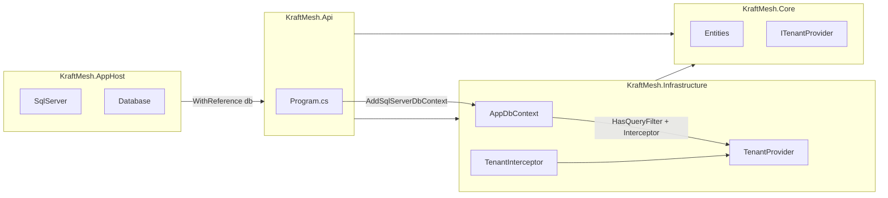

# Phase 2: Multi-tenant Domain and Data Layer

## Current state

- **KraftMesh.Core**: Class library with only `[DomainAssembly.cs](src/KraftMesh.Core/DomainAssembly.cs)`; no Entities folder.
- **KraftMesh.Api**: References ServiceDefaults and Core; `[Program.cs](src/KraftMesh.Api/Program.cs)` uses `AddServiceDefaults()` and has no DB registration.
- **KraftMesh.AppHost**: Orchestrates Api and Client; no SQL Server resource yet.
- **KraftMesh.Infrastructure**: Does not exist; must be created and added to `[kraftmesh.sln](kraftmesh.sln)`.

---

## 1. KraftMesh.Core – Entities and enums

**Create `Entities` folder** and add the following under `KraftMesh.Core`:

- `**ITenantEntity.cs`  
Interface with `Guid TenantId { get; }`. All tenant-scoped entities implement this.
- `**Neighborhood.cs`**  
Represents the tenant. Does **not implement `ITenantEntity` (it is the tenant). Properties: `Id` (Guid), `Name` (string), and any other tenant-level fields you need (e.g. `CreatedAt`). Use a key of `Id`.
- `**Resident.cs`  
User profile. Implements `ITenantEntity`. Properties: `Id` (Guid), `TenantId` (Guid, FK to Neighborhood), optional `UserId` (string) for future auth, and profile fields (e.g. `DisplayName`, `Email`).
- `**ResourceEntry.cs`  
Have/Need record. Implements `ITenantEntity`. Properties: `Id` (Guid), `TenantId` (Guid), `Category` (enum), `Severity` (enum), plus fields like `Title`, `Description`, `IsHave` (bool) or a `ResourceKind` enum, and timestamps.
- **Enums** (in `Entities` or a dedicated `Enums` folder):
  - `**ResourceCategory` – e.g. Tools, Skills, Goods, Services (adjust names to domain).
  - `**ResourceSeverity` – e.g. Low, Medium, High, Critical (for need urgency).

No project references or NuGet packages are required in Core; it stays dependency-free.

---

## 2. KraftMesh.Infrastructure – New project

**Create project and add to solution:**

- `dotnet new classlib -n KraftMesh.Infrastructure -o src/KraftMesh.Infrastructure` (target `net10.0`).
- Add to solution: `dotnet sln kraftmesh.sln add src/KraftMesh.Infrastructure/KraftMesh.Infrastructure.csproj`.
- **Project reference**: KraftMesh.Infrastructure → KraftMesh.Core only (no reference to Api or AppHost).

**Packages:**

- `Microsoft.EntityFrameworkCore.SqlServer` (10.x).
- `Microsoft.EntityFrameworkCore.Design` (10.x, for migrations).

**Implement:**

- `**ITenantProvider` (in Core or Infrastructure): Interface with `Guid? TenantId { get; }` or `Guid TenantId { get; }`. Implement in Infrastructure so it can be resolved from the current request (e.g. from HTTP context or claims; for Phase 2 a stub or config-based implementation is fine).
- `**TenantProvider`: Scoped service that returns the current tenant ID (e.g. from `IHttpContextAccessor`, header, or config for development).
- `**TenantInterceptor`: `SaveChangesInterceptor` that in `SavingChanges`/`SavingChangesAsync` iterates `ChangeTracker.Entries()`, and for every `EntityState.Added` entry that implements `ITenantEntity`, sets `TenantId` from `ITenantProvider.TenantId`. Register as scoped so it can inject `ITenantProvider`.
- `**AppDbContext`: Derives from `DbContext`.
  - Constructor: accept `DbContextOptions<AppDbContext>` and `ITenantProvider`; store tenant provider in a field (e.g. `_tenantProvider`).
  - `DbSet<Neighborhood> Neighborhoods`, `DbSet<Resident> Residents`, `DbSet<ResourceEntry> ResourceEntries`.
  - In `OnModelCreating`:
    - Configure `Neighborhood` (no query filter).
    - For each entity type that implements `ITenantEntity` (Resident, ResourceEntry), call `HasQueryFilter(e => e.TenantId == _tenantProvider.TenantId)`.
    - Configure relationships (e.g. Neighborhood 1–many Residents, Neighborhood 1–many ResourceEntries), and any indexes (e.g. composite on `(TenantId, Category)` for ResourceEntry).
  - Register the interceptor in `AddDbContext` (or in the Api when registering the context) so every context instance uses the same scoped `TenantInterceptor`.

**Important:** `HasQueryFilter` is evaluated at query compile time and captures `_tenantProvider`; because the DbContext and `ITenantProvider` are scoped, the tenant ID will be correct per request. Ensure DbContext is registered as **Scoped** (or use a scoped factory) so it is not a singleton.

**Initial migration:**

- From repo root: `dotnet ef migrations add InitialCreate --project src/KraftMesh.Infrastructure --startup-project src/KraftMesh.Api`.
- If Api does not reference Infrastructure yet, add the reference first (see below) so the startup project can load the same connection/config. This will generate the schema for Neighborhood, Resident, and ResourceEntry.

---

## 3. KraftMesh.Api – Reference Infrastructure and register DbContext

- **Project reference**: KraftMesh.Api → KraftMesh.Infrastructure.
- **NuGet**: In Api (or Infrastructure, depending on where you register the context), you need the Aspire EF Core SQL Server package for the host builder extension: add `Aspire.Microsoft.EntityFrameworkCore.SqlServer` to **KraftMesh.Api** (the project that calls `AddSqlServerDbContext`).

In **Api `Program.cs`**:

- Register `ITenantProvider` and `TenantProvider` (scoped).
- Register `TenantInterceptor` (scoped).
- Register DbContext using Aspire’s pattern:  
`builder.AddSqlServerDbContext<AppDbContext>(connectionName: "database");`  
and in the optional configure callback (if the overload supports it), add the interceptor:  
`options.AddInterceptors(serviceProvider.GetRequiredService<TenantInterceptor>());`  
If the Aspire extension does not allow adding interceptors in the same call, use the alternative: register the context with `builder.Services.AddDbContext<AppDbContext>(...)` (with `UseSqlServer` and connection string from config), add the interceptor there, then call `builder.EnrichSqlServerDbContext<AppDbContext>();` so Aspire still adds retries, health checks, and telemetry.

**Connection string:** The connection name (e.g. `"database"`) must match the AppHost resource name passed via `WithReference` (see AppHost section). The actual connection string will be injected by Aspire when the AppHost adds a SQL Server database resource and references it for the Api.

---

## 4. KraftMesh.AppHost – SQL Server and database resource

- Add NuGet **Aspire.Hosting.SqlServer** to AppHost (if not already present).
- In **AppHost `Program.cs`**:
  - Add SQL Server container: e.g. `var sql = builder.AddSqlServer("sql").WithLifetime(ContainerLifetime.Persistent);`
  - Add a database: e.g. `var db = sql.AddDatabase("database");`
  - When adding the Api project, pass the database reference so the Api receives the connection string: e.g. `builder.AddProject<Projects.KraftMesh_Api>("api").WithHttpHealthCheck("/health").WithReference(db);`
- This makes the connection string for `"database"` available to the Api so `AddSqlServerDbContext<AppDbContext>("database")` resolves correctly when running under AppHost.

---

## 5. Dependency and data flow summary

- **Read path:** Every query on `Residents` and `ResourceEntries` is filtered by `HasQueryFilter(e => e.TenantId == _tenantProvider.TenantId)`.
- **Write path:** On save, `TenantInterceptor` sets `TenantId` on any added entity that implements `ITenantEntity`.

---

## 6. Files to add or modify (summary)

| Path                                                             | Action                                                                                                           |
| ---------------------------------------------------------------- | ---------------------------------------------------------------------------------------------------------------- |
| `src/KraftMesh.Core/Entities/ITenantEntity.cs`                   | Create interface.                                                                                                |
| `src/KraftMesh.Core/Entities/Neighborhood.cs`                    | Create entity (tenant root).                                                                                     |
| `src/KraftMesh.Core/Entities/Resident.cs`                        | Create entity, implement ITenantEntity.                                                                          |
| `src/KraftMesh.Core/Entities/ResourceEntry.cs`                   | Create entity, implement ITenantEntity.                                                                          |
| `src/KraftMesh.Core/Entities/ResourceCategory.cs`                | Create enum.                                                                                                     |
| `src/KraftMesh.Core/Entities/ResourceSeverity.cs`                | Create enum.                                                                                                     |
| `src/KraftMesh.Infrastructure/`                                  | New project; add to solution.                                                                                    |
| `src/KraftMesh.Infrastructure/KraftMesh.Infrastructure.csproj`   | Add EF Core 10 SqlServer + Design, ref Core.                                                                     |
| `src/KraftMesh.Infrastructure/ITenantProvider.cs` or in Core     | Interface; implement in Infra.                                                                                   |
| `src/KraftMesh.Infrastructure/Services/TenantProvider.cs`        | Scoped implementation.                                                                                           |
| `src/KraftMesh.Infrastructure/Interceptors/TenantInterceptor.cs` | SaveChangesInterceptor.                                                                                          |
| `src/KraftMesh.Infrastructure/AppDbContext.cs`                   | DbContext with query filters and DBSets.                                                                         |
| `src/KraftMesh.Infrastructure/Migrations/...`                    | Initial migration.                                                                                               |
| `src/KraftMesh.Api/KraftMesh.Api.csproj`                         | Add ref to Infrastructure, add Aspire.Microsoft.EntityFrameworkCore.SqlServer.                                   |
| `src/KraftMesh.Api/Program.cs`                                   | Register ITenantProvider, TenantInterceptor, AddSqlServerDbContext (or AddDbContext + EnrichSqlServerDbContext). |
| `src/KraftMesh.AppHost/KraftMesh.AppHost.csproj`                 | Add Aspire.Hosting.SqlServer if needed.                                                                          |
| `src/KraftMesh.AppHost/Program.cs`                               | Add SqlServer + database resource, WithReference(db) on Api.                                                     |
| `kraftmesh.sln`                                                  | Add KraftMesh.Infrastructure.                                                                                    |

---

## 7. Verification

- `dotnet build kraftmesh.sln` succeeds.
- Run AppHost; confirm Api starts and can resolve `AppDbContext` and `ITenantProvider`.
- Optionally apply migrations at startup in Api (e.g. `context.Database.Migrate()` in dev) or run `dotnet ef database update --project src/KraftMesh.Infrastructure --startup-project src/KraftMesh.Api` and then run the AppHost and open the SQL Server container to confirm tables exist.

---

## 8. Design notes

- **ITenantProvider in Core vs Infrastructure:** Define the interface in Core so that both Api and Infrastructure can depend on it without Api referencing Infrastructure for interfaces. Implement `TenantProvider` in Infrastructure; register it in Api when wiring the DB.
- **Neighborhood and query filter:** Only entities that implement `ITenantEntity` get a query filter. Neighborhood is the tenant aggregate root and is not filtered by TenantId; access to neighborhoods should be controlled by application logic (e.g. only list neighborhoods the current user is allowed to see).
- **Stub tenant for Phase 2:** If you do not yet have auth or headers, implement `TenantProvider` to return a fixed Guid from config or a default for development so that migrations and basic API calls work.

